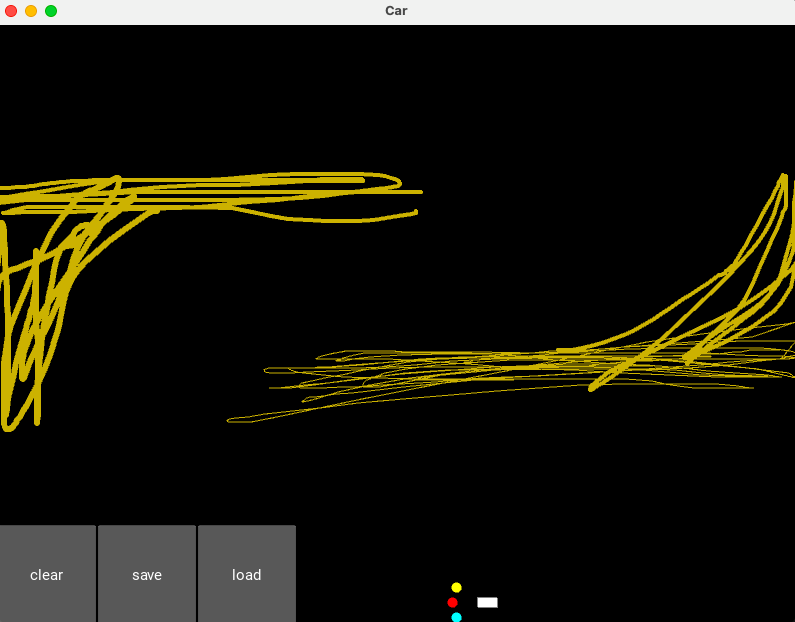

# DataScience Project: Self_Driving_Car using Deep Q-Learning
## Overview

- Create a bot able to learn how to move between 2 points (top left corner and bottom right corner) in the most efficient way.

- Use Kivy for the environment (map + car).

- Network with 2 hidden layer with ReLu function and adam optimizer.

- Possibility to save the Neural Network for later work.

## Code and ressources used

- **Python version :** 2
- **Packages :** numpy, torch, Kivy, random, matplotlib, os
- **Run :** - python3 -m venv venv
            - source venv/bin/activate
            - pip3 install -r requirements.txt
- **Kivy Tutorial:** https://www.youtube.com/playlist?list=PLhTjy8cBISEpobkPwLm71p5YNBzPH9m9V

## Image

